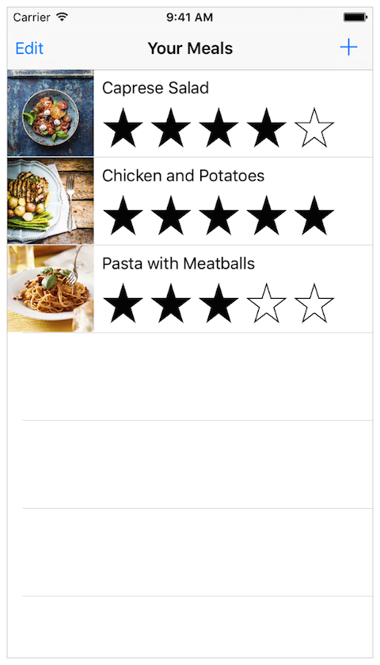
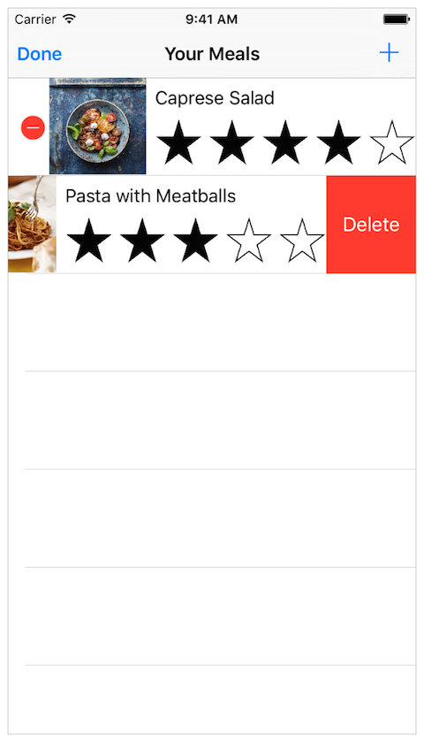
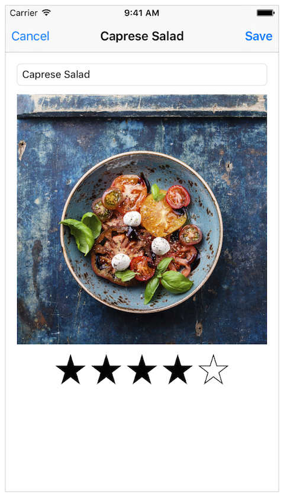
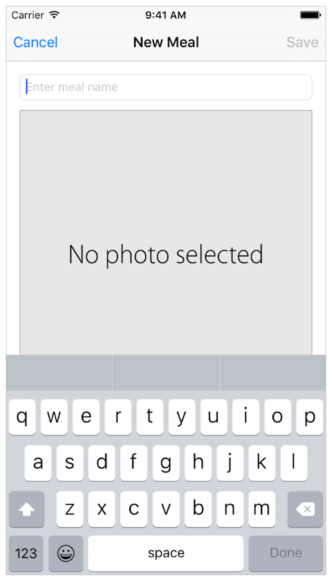

## FoodTracker

###### Start Developing iOS Apps (Swift) <https://developer.apple.com/library/ios/referencelibrary/GettingStarted/DevelopiOSAppsSwift/index.html>

#### Summary

Start Developing iOS Apps (Swift) is the perfect starting point for creating apps that run on iPhone and iPad. View this set of incremental lessons as a guided introduction to building your first app—including the tools, major concepts, and best practices that will ease your path.

Each lesson contains a tutorial and the conceptual information you need to complete it. The lessons build on each other, walking you through a step-by-step process of creating a simple, real-world iOS app.

As you make your way through the lessons and build the app, you’ll learn about concepts in iOS app development, gain a deeper understanding of the Swift programming language, and familiarize yourself with the many valuable features of Xcode, Apple’s integrated development environment (IDE).

#### Syllabus

| Lesson | Topics |
|:----:|--------|
| 1 | Getting Started |
|  | - Jump Right In |
|  | - Learn the Essentials of Swift |
| 2 | Building the UI |
|  | - Build a Basic UI |
|  | - Connect the UI to Code |
|  | - Work with View Controllers |
|  | - Implement a Custom Control |
|  | - Define Your Data Model |
| 3 | Working with Table Views |
|  | - Create a Table View |
|  | - Implement Navigation |
|  | - Implement Edit and Delete Behavior |
|  | - Persist Data |

#### Screenshots

